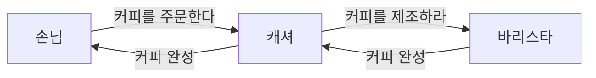

# 객체지향 프로그래밍

```👉 현실 세계에 존재하는 사물에 대한 것은 비유임 위 같은 패러다임으로 프로그래밍을 지향하는 것.```

- 객체란 현실 세계에 존재하는 사물에 대한 추상화
- 즉, 현실 속에 존재하는 사물을 최대한 유사하게 모방하여 소프트웨어 내부로 옮겨오는 작업
- 객체지향의 목표는 새로운 세계를 창조하는 것

# 협력하는 사람들

```
👉 역할이라는 단어는 의미적으로 책임이라는 개념을 내포함. 특정한 역할은 특정한 책임을 암시함.
ex) 바리스타 역할을 맡은 사람은 주문된 커피를 제조해야 할 책임이 있음.
```

커피를 주문하는 프로세스를 비유하여 각 객체들을 살펴보자.

- 커피를 주문하는 손님, 주문을 받는 캐셔, 제조를 하는 바리스타라는 **역할**이 존재한다.
- 손님, 캐셔, 바리스타는 주문한 커피를 손님에게 제공하기 위해 **협력**하는 과정에서 자신이 맡은 바 **책임**을 다한다.
    - 손님 : 커피 주문
    - 캐셔 : 주문 받기
    - 바리스타 : 커피 제조
- 객체지향에서 가장 중요한 3가지는 역할, 책임, 협력이다.

# 요청과 응답으로 구성된 협력

``` 👉 역할과 책임은 협력이 원할하게 진행되는 데 필요한 핵심적인 구성 요소임.```

- 협력하는 관계에서는 역할이 필요하기 때문에 연쇄적인 요청을 통하여 응답을 받는다.
- 요청을 받으면 주어진 책임을 다하며 요청에 응답한다. 응답 역시 연쇄적으로 전달된다.
- Request : 커피 주문, 커피 제조
- Response : 커피 완성



# 역할, 책임, 협력

```
👉 기능 구현 == 협력
협력의 성공은 각 객체의 역할과 책임을 얼마나 성실히 이행하는지에 따라 판단됨.
```
다음과 같이 바꾸면 대부분의 설명을 객체지향이라는 문맥으로 옮겨올 수 있음.

- 객체 : 손님, 캐셔, 바리스타.
- 메시지 : 객체의 요청
    - 커피 주문, 커피 제조 등
- 메서드 : 요청을 처리하는 방법

역할은 유연하고 재사용 가능한 협력 관계를 구축하는데 중요한 설계 요소이다. 대체 가능한 역할과 책임은 객체지향 패러다임의 중요한 기반을 제공하는 다형성과도 깊이 연관돼있음.

# 협력 속에 사는 객체

- 협력이 얼마나 조화를 이루는지를 결정하는 것은 객체임.
    - 결국 협력의 품질을 결정하는 것은 객체의 품질임.
- 객체는 다른 객체의 요청에 잘 응답하고, 적극적으로 도움을 요청할 수 있어야 한다.
- 객체는 자율적이어야 한다.
    - 행동을 스스로 결정하고 책임짐
        - 어떠한 행위에 대해서 스스로 판단하고 행동
- 객체는 상태(state)와 행동(behavior)을 함께 지닌 실체임.
    - 자율성 : 상태를 직접 관리하고, 상태 기반으로 스스로 판단 후 행동
- 메시지는 객체지향의 오직 한가지 의사소통임. 즉 다른 객체와 협력하기 위해 메시지를 전송함.
    - 객체 → 객체에게 요청하는 것이 메시지
- 메서드는 객체가 수신된 메시지를 처리하는 방법임
    - ex) 커피 제조 요청은 메시지이고, 커피를 제조하는 구체적인 방법이 메서드임

# 객체지향의 본질

- 자율적인 객체를 공동체로 바라보고 객체를 이용해 시스템을 분할하는 방식
- 자율적인 객체란 상태와, 행위를 함께 지니며 자신을 책임지는 객체임
- 객체는 시스템의 행위를 구현하기 위해 다른 객체들과 협력함
- 메시지를 수신한 객체는 메시지를 처리하는 데 적합한 메서드를 자율적으로 선택함

# 결론

- 클래스는 객체들의 협력 관계를 코드로 옮기는 도구에 불과함.
- 핵심은 적절한 책임을 수행하는 역할 간의 유연하고 견고한 협력 관계를 구축하는 것.
- 클래스들의 정적인 관계가 중요한 것이 아니라, 메시지를 주고 받는 객체들의 동적인 관계가 중요함.
- 클래스의 구조와 메서드가 아닌 객체의 역할, 책임, 협력에 집중할 것.
