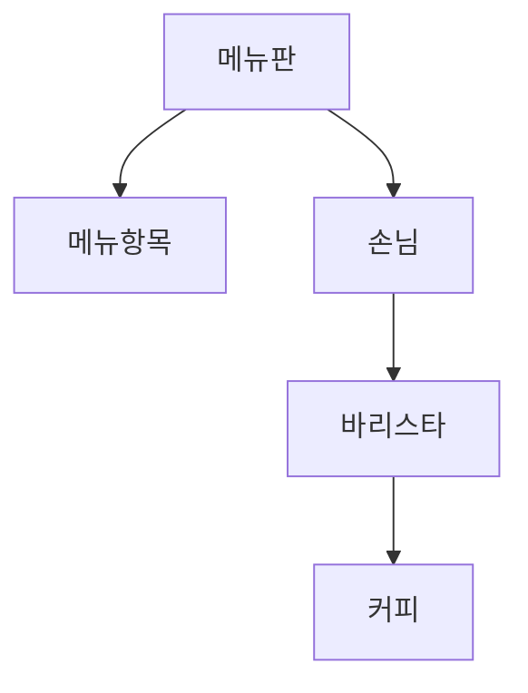

# 7장 - 함께 모으기

```kotlin
인터페이스와 구현을 분리하는 것은 훌륭한 객체지향 설계를 낳는 가장 기본적인 원칙이다.
```

# 클래스 설계
- 클래스는 개념, 명세, 구현 관점 세 가지를 모두 수용해야함.
    - 클래스가 은유하는 `개념`은 도메인 관점을 반영
    - 클래스의 공용 인터페이스는 `명세`관점
    - 클래스의 프로퍼티와 메서드는 `구현`관점

# 커피 전문점 도메인



```kotlin
도메인 모델은 타입 간 어떤 관계가 존재한다는 사실을 이해하는 것만으로도 충분함.
```

- 도메인 모델을 설계한 후, `협력을 설계`할 것.
    - 객체지향 설계의 첫 번째 목표는 훌륭한 객체를 설계하는 것이 아닌 훌륭한 협력을 설계하는 것.
    - 훌륭한 객체는 훌륭한 협력을 설계할 때만 얻을 수 있다.
- 즉, 적절할 객체에 적절한 책임을 할당.

# 설계하고 구현하기

- 협력을 설계할 땐 객체가 메시지를 선택하는 것이 아닌, 메시지가 객체를 선택하게 해야함.
    - 메시지를 먼저 선택하고 그 후 메시지를 수신하는 적절한 객체를 선택.
- 메시지를 처리할 객체를 찾고 있다면, 책임을 수행하기에 적절한 타입이 존재하는지 확인.
- 스스로 할 수 없는 일은 메시지를 전송해 다른 객체에게 도움을 요청.
- 객체가 수신한 메시지가 객체의 인터페이스를 결정한다.
